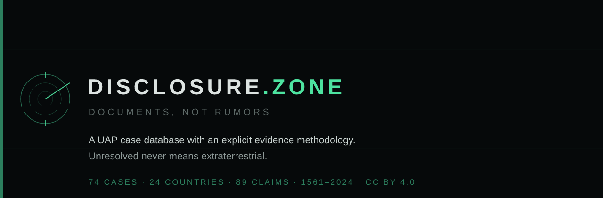

<p align="center">
  
</p>

<p align="center">
  <a href="https://disclosure.zone"><b>disclosure.zone</b></a> ·
  <a href="https://disclosure.zone/methodology">Methodology</a> ·
  <a href="https://disclosure.zone/toolkit">Sensor Sanity Toolkit</a> ·
  <a href="https://disclosure.zone/data">Open data</a>
</p>

---

A UAP case database with an explicit evidence methodology.

The premise: **the UAP problem is not a shortage of cases, it is a shortage of data.**

## What is in here

- **74 cases** from 24 countries, from 1561 to cases still open in 2024
- **89 claims** in a myth-versus-document ledger, each with its origin, source tier,
  verification status and the condition that would settle it
- **14 state programmes** across the US, France, the UK, Italy, Chile, Canada,
  Australia, Sweden, Spain, Brazil, Norway, Belgium and the USSR
- **Sensor Sanity Toolkit** — an interactive parallax calculator worked on the GOFAST footage
- **World map** with per-country filtering, rendered at build time
- **Per-case Open Graph images**
- **Open data** — JSON and CSV under CC BY 4.0

## Methodology

Every case is scored 0–5 on eight independent axes: **S** witnesses, **R** radar/sensor,
**O** optical/IR, **P** physical trace, **M** multi-channel, **T** documentation,
**X** anomalousness, **D** data available today. The axes measure how well documented
a case is, not how anomalous it is.

Every source carries a tier, **T1–T5**, from a contemporaneous operational document down
to a media claim with nothing behind it. A missing link to the material is shown in the
interface, never hidden.

Full description: [`/methodology`](https://disclosure.zone/methodology).

## Languages

English is the primary language (`/`); Polish is the second version (`/pl/`).
The switcher lives in the footer, deliberately understated.

## Running it

```bash
npm install
npm run dev      # http://localhost:4321
npm run build    # -> dist/
npm run preview
```

## Layout

```
src/content/cases/*.md   canonical record: structure + English text
src/content/pl/*.md      Polish overlay: text only, no structure
src/lib/cases.ts         merges the record with its overlay
src/data/sources.ts      registry of verified links (cases refer to it by key)
src/data/claims.ts       claim ledger, bilingual
src/data/archives.ts     registry of state archives, bilingual
src/lib/scoring.ts       the S–D scale, weights, evidence classes
src/lib/og.ts            Open Graph image generator (satori + resvg)
src/components/          Logo, WorldPlot (d3-geo + world-atlas), HeroScope, Scorecard, Sources
src/pages/[...lang]/     pages in both language versions
src/pages/api/           cases.json, claims.json, sources.json, cases.csv
scripts/check-data.mjs   corpus consistency check, runs before every build
scripts/make-banner.mjs  renders docs/banner.png
```

Stack: Astro 7, no UI framework, static output. The map and the OG images are rendered
at build time, so there is no runtime dependency on the client beyond a little vanilla JS
for the map, the filters and the calculator.

## State of the data

The corpus is a selection of the cases with the highest analytical value. It is not a
complete index, and it does not claim to be.

Links fall into three categories and are **never mixed**:

- **74 of 170** sources have an address for the material itself — the only ones that
  count toward provenance
- **40** point at the archive that holds the document (NARA, TNA Discovery, NAA
  RecordSearch, LAC, GEIPAN, Arquivo Nacional) — useful, but an archive is not a document
- **56** have neither, so far

Every address in the registry was checked against a live source rather than guessed. The
provenance counter is visible on each case and on [`/about`](https://disclosure.zone/about).

`npm run check:data` validates the canonical records against their overlays and the
cross-references between cases and claims. The build fails if anything drifts.

## Editorial rules

1. Every claim carries a source tier, T1–T5.
2. "Authentic recording" and "identified object" are never merged.
3. "Unresolved" never means "extraterrestrial".
4. A missing source link is visible in the interface, not hidden.

## Licence

Content under CC BY 4.0. Source documents remain the property of the issuing institutions.
